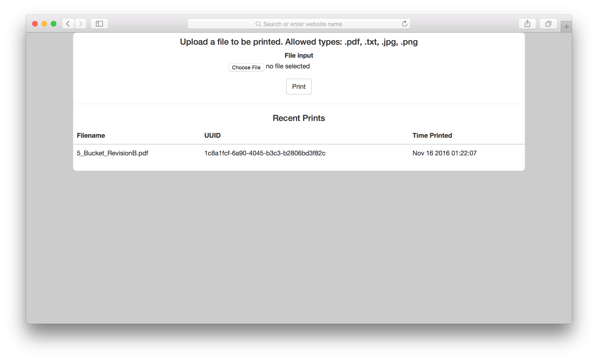

# Simple Printing Kiosk

A simple way to host a print webapp for a home or small business. Easier than configuring printers on ever-changing computers and simpler for guests to use too. 



## How it works

When a file is uploaded, the server calls the configured command on the path of the uploaded file (default command is `lp`, which adds the file to the CUPS queue)


## Limitations

At this time, this has only been tested with one printer and on Linux and OS X. I have no idea how it would work on Windows, BSD, etc.


## Prerequisites
 
 * Connect a printer to your server of choice
 * Install cups, such as: `sudo apt install cups`
 * Install requirements:

```
cd simple_print_server/
python3 -m venv ./venv/
source ./venv/bin/activate
pip install -r requirements.txt
```


## Manual deployment

```
cd simple_print_server/
source ./venv/bin/activate
python3 ./run.py &
disown -h %
```


## Deployment in Docker

Build Docker image and deploy a container locally:

```
docker build -t printing-kiosk:latest .
docker-compose up -d
```

Or build Docker image for arm64 and publish it in the registry:

```
docker buildx build --platform linux/arm64 -t printing-kiosk:latest .
docker tag printing-kiosk docker.local/printing-kiosk
docker login docker.local
docker push docker.local/printing-kiosk
```

Use `http://127.0.0.1:1631` to configure your printer in CUPS.

## Troubleshooting

Use `/usr/lib/cups/backend/usb` to ensure the printer is properly connected to CUPS:

```
/usr/lib/cups/backend/usb
DEBUG: list_devices 
DEBUG: libusb_get_device_list=13 
DEBUG2: Printer found with device ID: MFG:Samsung;CMD:GDI;MDL:ML-2510 Series;CLS:PRINTER;STATUS:BUSY; Device URI: usb://Samsung/ML-2510%20Series?serial=3V61BKAQ411232V. 
direct usb://Samsung/ML-2510%20Series?serial=3V61BKAQ411232V. "Samsung ML-2510 Series" "Samsung ML-2510 Series" "MFG:Samsung;CMD:GDI;MDL:ML-2510 Series;CLS:PRINTER;STATUS:BUSY;" "" 
```

